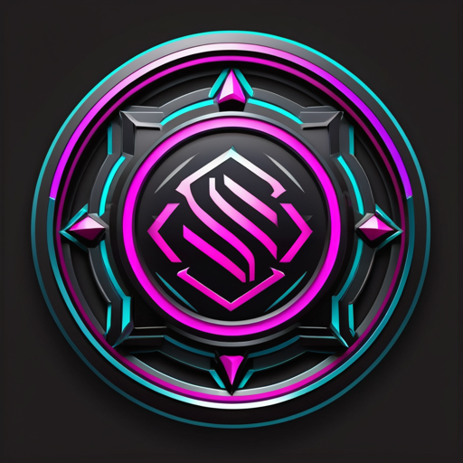

<p align="center">
  
</p>

<h1 align="center">Synthetrix</h1>

<p align="center"><em>CivitAI checkpoint/LoRA harvester — index → choose → fetch, HDD vault → NVMe on demand.</em></p>

A three-stage pipeline to **index → choose → fetch** the best/latest CivitAI
checkpoints & LoRAs, store them on the HDD vault, and promote to NVMe on demand.

## Why three stages

The expensive part (terabytes of model blobs) is decoupled from the cheap part
(the JSON index). You crawl a megabyte-scale catalog first, make choices against
it locally, and only then pull the blobs you actually want.

```
build_index.py  →  catalog.sqlite + usage/*.md + ONE starter image/model  [~MB]
pick.py         →  browse/filter the index, get file_ids
fetch.py        →  download model to vault, verify SHA256, promote to NVMe,
                   AND harvest the full N example images + workflows   [the GB]
harvest_images.py  →  batch re-harvest (downloaded models by default; --all)
```

**Images are lazy.** At index time you keep just one preview thumbnail per model.
The full `per_model` (default 20) example images + their embedded ComfyUI
workflows are pulled **only when you actually download that model** via fetch.py
— so image storage tracks your selections, not the whole catalog.

Crawled model types (`config.toml [crawl] types`): **Checkpoint, LORA, LoCon,
TextualInversion** — the NSFW-bearing types. (VAE/Controlnet/Upscaler are utility
/ content-neutral; grab those on demand, not in bulk.)

## Storage layout (see config.toml)

| Tier | Path | Role |
|------|------|------|
| HDD vault | `H:/Models/{checkpoints,loras,flux,...}` | authoritative blobs + catalog |
| Catalog   | `H:/Models/.civitai/catalog.sqlite` + `usage/*.md` | the index |
| NVMe stage| `E:/model loader/ComfyUI/models/...` | promoted on demand for ComfyUI |

`promote_mode = "copy"` by default. Set to `"symlink"` for zero-copy promotion
(needs Windows Developer Mode or an elevated shell).

## Setup

```sh
pip install -r requirements.txt
cp .env.example .env        # then add your CIVITAI_TOKEN
```

The token (create at https://civitai.com/user/account) is required for NSFW and
creator-gated downloads. After the April 2026 split the API still lives on
`civitai.com` (reachable via `civitai.red`); the token's account must be
opted into Red to see mature content. One account, one DB behind both domains.

## Usage

```sh
# 1. Build the curated index (top-N per type x base_model x ranking)
python build_index.py --dry-run          # preview the crawl plan
python build_index.py                     # full crawl per config.toml
python build_index.py --type LORA --no-nsfw
python build_index.py --no-starter        # skip the preview thumbnails

# 1b. Keep the index fresh (incremental — no full re-crawl)
python build_index.py --delta             # new-publish catch-up (Newest, early-stop)
python build_index.py --refresh           # re-pull known rows via /models ?ids=

# 1c. Targeted crawls (filters AND onto every pass)
python build_index.py --tag character
python build_index.py --query "cyberpunk" --type LORA
python build_index.py --username someCreator
python build_index.py --checkpoint-type Merge --type Checkpoint

# 2. Browse and choose
python pick.py --type Checkpoint --base "Flux.1 D" --limit 20
python pick.py --type LORA --sort rating --min-downloads 5000
python pick.py --search "pixel art" --ids-only        # -> file_ids

# 3. Fetch: download model + auto-harvest 20 images & workflows, optional promote
python fetch.py 123456 123457 --promote
python fetch.py 123456 --images-count 10              # 10 images instead of 20
python fetch.py 123456 --no-images                    # model only, no images
python pick.py --type LORA --base Pony --ids-only | python fetch.py --stdin --promote
python fetch.py --promote-only 123456                 # vault -> NVMe only

# Backfill / re-harvest images for already-downloaded models
python harvest_images.py                              # downloaded models, per=config
python harvest_images.py --all --max-models 50        # widen to any catalog model
```

## What the index gives you per model

Stats (downloads/rating/thumbs), base model, NSFW flag, file size (plan against
disk **before** pulling), SHA256 (dedupe + integrity), and a `usage/<model>.md`
with **trigger words** + the author's recommended-settings notes.

## API notes / gotchas

- **Cursor pagination is mandatory** for deep crawls: `page*limit > 1000` → 429.
  The client uses `metadata.nextCursor` automatically.
- `query` (full-text) switches the API to **Meilisearch offset pagination**
  (numeric `metadata.nextPage`); the client follows that as a fallback when no
  cursor is returned.
- **No `updatedAt`/updated-since filter exists** on `/models`, and models carry
  no `updatedAt` field — so `--delta` is *client-computed*: it crawls `Newest`
  and stops each pass after `stop_after_known` consecutive already-indexed ids
  (publish order tracks id). There is likewise **no bulk metadata dump** to
  download; `catalog.sqlite` *is* the local metadata database, kept current by
  `--delta` (new publishes) and `--refresh` (freshen known rows via `?ids=`).
- `limit` max is 100. Be polite: `requests_per_min` throttles + backs off on 429.
- **The `/images` `meta` field is stripped** (empty for ~all images, SFW & NSFW).
  The only reliable source for the recipe is the **original PNG's text chunks** —
  `harvest_images.py` downloads `/orig` and parses `tEXt`/`iTXt`/`zTXt` for the
  ComfyUI `workflow`/`prompt` graph and A1111 `parameters`. JPEG/WebP originals
  are re-encoded by CivitAI and carry **nothing** recoverable (pixels only).

## Image-harvest storage

`<gallery_root>/<model_id>/<image_id>.png` + `<image_id>.workflow.json`
(ComfyUI graph) + `<image_id>.params.txt` (A1111). Budget ~2 MB/image. Because
the full set is pulled only on download, total image storage scales with how many
models you actually fetch — e.g. 200 fetched models × 20 ≈ ~8 GB, not the whole
catalog. Starter previews add ~1 image/model across the index (~a few GB).
